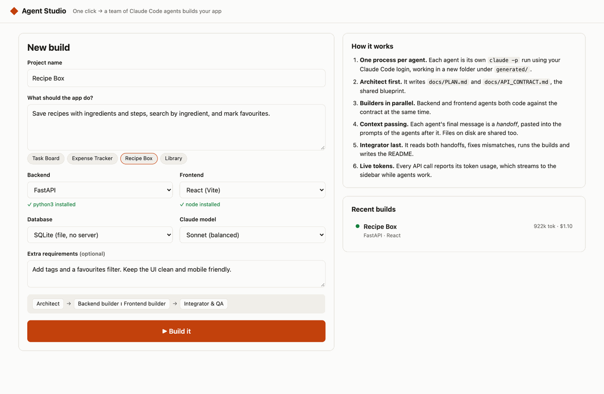
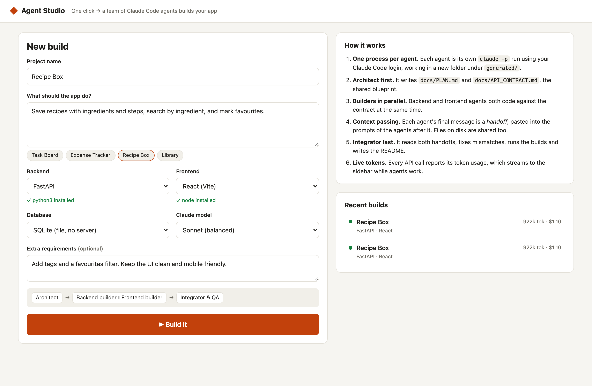
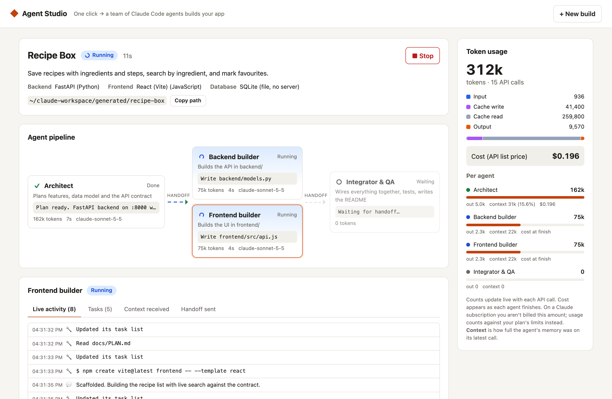
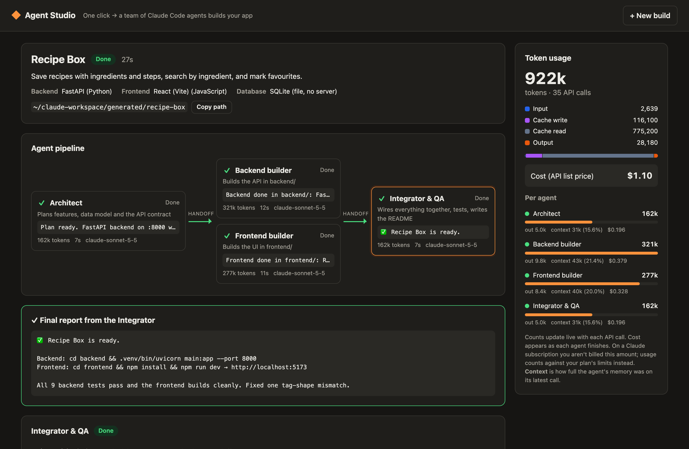
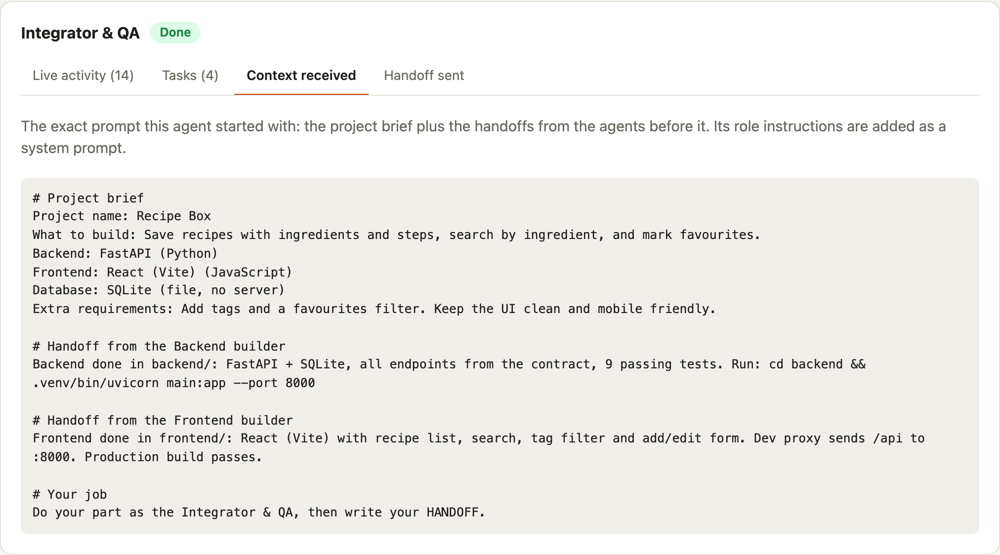
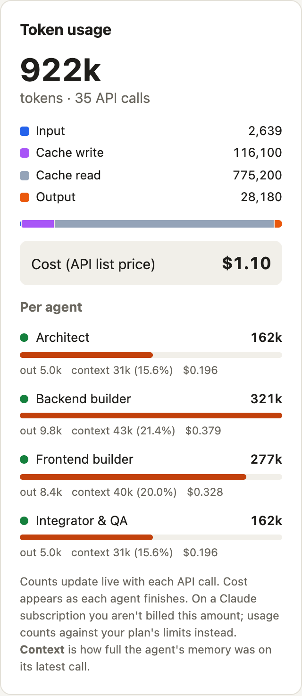
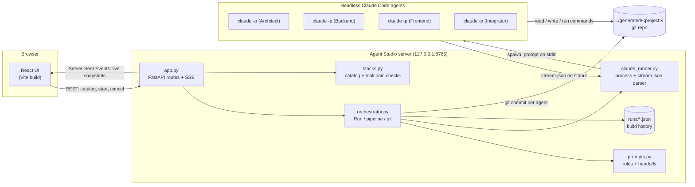
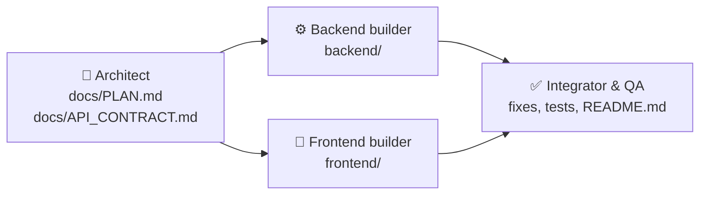
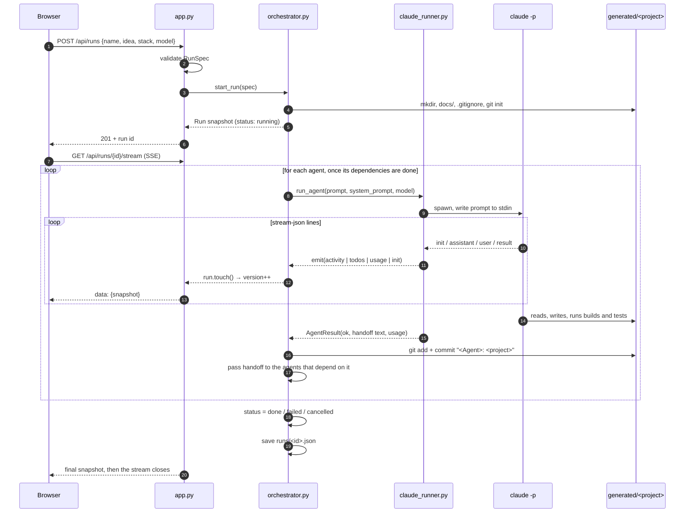

<div align="center">


# Agent Studio

### Describe an app. Click one button. Watch a team of AI agents build it.

A local web app that coordinates a team of headless **Claude Code** agents (Architect, Backend,
Frontend and Integrator) to build a full-stack app from a short description, with live activity,
handoffs and token tracking.

[](https://www.python.org/)
[](https://fastapi.tiangolo.com/)
[](https://react.dev/)
[](https://vite.dev/)
[](https://docs.claude.com/en/docs/claude-code/overview)
[](#-testing)
[](https://github.com/Pembu/AgentStudio/tags)

[**Quick start**](#-quick-start) ·
[**Screenshots**](#-screenshots) ·
[**How it works**](#-how-it-works) ·
[**API**](#-api-reference) ·
[**Extend it**](#-extending-agent-studio) ·
[**FAQ**](#-faq)

<br/>



<sub>A full build of a "Recipe Box" app: the Architect plans, two builders work in parallel,
and the Integrator checks everything and reports. Tokens update live. (Recorded in demo mode.)</sub>

</div>

---

## ✨ Features

<table>
<tr>
<td width="33%" valign="top">

### 🚀 One click, whole app
Turn a short description into a working project with a backend, a frontend, tests and a
README.

</td>
<td width="33%" valign="top">

### 🧩 Any stack
**12** backends, **7** frontends and **5** databases, or type your own custom stack.
You can leave out the backend or the frontend.

</td>
<td width="33%" valign="top">

### ⚡ Parallel agents
The Backend and Frontend builders work **at the same time** from a shared API contract.

</td>
</tr>
<tr>
<td valign="top">

### 👀 Full visibility
See each agent's live activity, task list, **the exact context it received** and the handoff
it sent.

</td>
<td valign="top">

### 📊 Live token tracking
Input, output and cache tokens per agent, updated with every API call. Exact cost is shown
when each agent finishes.

</td>
<td valign="top">

### 🗂️ Readable git history
Each generated project is its own git repository with **one commit per agent**.

</td>
</tr>
<tr>
<td valign="top">

### 🔒 Safe defaults
Listens on `127.0.0.1` only, blocks cross-site requests and DNS rebinding, and tells agents to
stay inside the project folder.

</td>
<td valign="top">

### 🔑 Uses your login
Runs on your existing Claude Code login, so you don't need a separate API key.

</td>
<td valign="top">

### 🛠️ Small and hackable
About 900 lines of Python and 600 lines of React. Adding a stack, model or agent is a
few lines of code.

</td>
</tr>
</table>

---

## 📸 Screenshots

### Start a build
Pick an example or describe your own app, choose the stack and model, and click **Build it**.
The form shows whether each stack's toolchain is installed.

<picture>
  <source media="(prefers-color-scheme: dark)" srcset="docs/images/new-build-dark.png">
  
</picture>

### Watch the agents work
The pipeline shows each agent's status. Click any agent to see its live activity.
The builders run side by side.



### Get a finished, tested project
When the Integrator finishes, its final report tells you how to run the app.
Dark mode follows your system setting.



<table>
<tr>
<td width="62%" valign="top">

**See exactly what each agent was told**<br/>
The *Context received* tab shows the full prompt: the project brief plus the handoffs from the
agents before it.



</td>
<td width="38%" valign="top">

**Every token, accounted for**<br/>
Usage by type, by agent, context-window fill and cost.



</td>
</tr>
</table>

---

## 🚀 Quick start

### Prerequisites

| Requirement | Why |
|---|---|
| **Python 3.10+** | Runs the FastAPI backend |
| **Node.js 18+ and npm** | Builds the React UI |
| **[Claude Code CLI](https://docs.claude.com/en/docs/claude-code/setup)**, logged in | The agents are `claude -p` processes |
| **git** (optional) | Commits each agent's work in the generated project |
| Toolchains for the stacks you pick (optional) | For example `java` + `mvn` for Spring Boot, or `go` for Gin. Without them, agents still write the code but can't build or test it. |

### Install and run

```bash
git clone https://github.com/Pembu/AgentStudio.git
cd AgentStudio
./start.sh
```

Then open **http://127.0.0.1:8765**. 🎉

On first run, `start.sh` creates a virtualenv, installs the Python and npm packages, and builds
the UI. Later runs start in seconds.

> [!TIP]
> **Try it without spending tokens.** This runs a fake Claude that returns realistic, scripted
> output, which is handy for exploring the UI:
> ```bash
> CLAUDE_BIN=$PWD/tests/fake_claude.py ./start.sh
> ```

---

## 🧭 Using it

1. **Describe the app.** Give it a name and a plain-English description, or click an example
   such as *Task Board*, *Expense Tracker*, *Recipe Box* or *Library*.
2. **Pick a stack.**

   | Layer | Options |
   |---|---|
   | Backend | FastAPI · Django · Flask · Spring Boot · Quarkus · Express · NestJS · Gin · ASP.NET Core · Axum · Rails · Laravel · *Custom* · *None* |
   | Frontend | React (Vite) · React + TS · Angular · Vue · Svelte · Next.js · Plain HTML + JS · *Custom* · *None* |
   | Database | SQLite · PostgreSQL · MySQL · MongoDB · In-memory · *Custom* |
   | Model | Claude Code default · Opus · Sonnet · Haiku |

3. **Add notes (optional).** For example *"use Tailwind"* or *"add JWT login"*.
4. **Click ▶ Build it.** The build page shows:
   - **Pipeline:** each agent's status, timing and token count.
   - **Agent tabs:** *Live activity* · *Tasks* · *Context received* · *Handoff sent*.
   - **Token sidebar:** totals, token types, per-agent usage and cost.
   - **Timeline:** starts, finishes and handoffs.
   - **■ Stop:** cancels the build and terminates the agents.
5. **Run your app.** It's in `../generated/<project-name>/`. Follow the `README.md` the
   Integrator wrote, and run `git log` to see what each agent did.

---

## 🧠 How it works

### Architecture



| Layer | Responsibility |
|---|---|
| **React UI** (`frontend/src/`) | Build form, live pipeline, agent detail, token sidebar. Uses a hash router (`#/` and `#/run/<id>`). |
| **API** (`backend/app.py`) | Validates requests, serves the catalog, starts and cancels runs, streams snapshots over SSE, serves the built UI, and enforces local-only access. |
| **Orchestrator** (`backend/orchestrator.py`) | Holds each `Run`'s state, runs agents as soon as their dependencies finish, passes handoffs along, commits to git, and saves history. |
| **Runner** (`backend/claude_runner.py`) | Starts one `claude -p` process, feeds it the prompt, and turns its `stream-json` output into `activity`, `todos`, `usage` and `init` events. |
| **Prompts** (`backend/prompts.py`) | Shared rules for every agent, one task per role, and the brief and handoff template. |
| **Stacks** (`backend/stacks.py`) | The catalog of stacks and models, plus detection of which toolchains are installed. |

### The agent team



| Agent | Does | Doesn't |
|---|---|---|
| 🧭 **Architect** | Checks toolchains, writes the plan (features, data model, layout, ports, commands) and an exact API contract | Write application code |
| ⚙️ **Backend builder** | Implements the contract in `backend/`, adds tests and runs them | Touch `frontend/` |
| 🎨 **Frontend builder** | Builds the UI in `frontend/` against the contract and runs the production build | Wait for or read `backend/` |
| ✅ **Integrator & QA** | Fixes mismatches between frontend and backend, runs every build and test, smoke-tests the API, writes `README.md` | n/a |

Each agent **starts as soon as all of its dependencies finish** (`PIPELINE` in
`orchestrator.py`), so the two builders run in parallel. If you choose **None** for the backend
or the frontend, that builder is removed and the dependencies adjust. If an agent fails, the
agents that depend on it are **skipped**.

### How context moves between agents

Agents share context in two ways:

1. **📄 Files on disk.** The Architect writes `docs/PLAN.md` and `docs/API_CONTRACT.md`, which
   every later agent reads. The builders' code is on disk for the Integrator.
2. **🤝 Handoff notes.** Each agent's final message, kept under 300 words, is pasted into the
   prompt of every agent that depends on it.

```text
# Project brief
Project name / What to build / Backend / Frontend / Database / Extra requirements

# Handoff from the Architect
<the Architect's final summary>

# Your job
Do your part as the Backend builder, then write your HANDOFF.
```

The **system prompt** is `COMMON_RULES` (stay in the project, keep it an MVP, use project-local
dependencies only, no sudo, no foreground servers, no secrets) followed by the role's task. It's
passed with `--append-system-prompt`.

### Life of a build

<details>
<summary><b>Show the sequence diagram</b></summary>



</details>

### Live updates and token tracking

<details>
<summary><b>How the stream and the token counts work</b></summary>

**Live stream.** Each `Run` has a `version` counter. Every event increments it and wakes any
waiting listeners. `/api/runs/{id}/stream` sends a full JSON snapshot whenever the version
changes, at most about 4 per second. It sends a keep-alive comment every 15 s when nothing is
happening, and closes once the run finishes.

**Parsing `stream-json`.** `claude -p --output-format stream-json --verbose` prints one JSON
object per line:

| Line type | What Agent Studio takes from it |
|---|---|
| `system` / `init` | Model name and session id |
| `assistant` | Text, which shows as activity; tool calls, summarized as `$ npm test` or `Write backend/app.py`; `TodoWrite` lists, which show as tasks; per-call token usage |
| `user` | Tool results that failed, which show as errors |
| `result` | The final handoff, exact token totals (`modelUsage`, including subagents), `total_cost_usd`, number of turns and context window size |

One API response can arrive as several `assistant` lines with the same message id, so usage is
stored **per message id** to avoid counting it twice. The `result` line then replaces the live
numbers with the authoritative totals.

| Token type | Meaning |
|---|---|
| 🟦 Input | New prompt tokens sent to the model |
| 🟪 Cache write | Prompt tokens stored in the prompt cache |
| ⬜ Cache read | Prompt tokens reused from the cache (much cheaper) |
| 🟧 Output | Tokens the model wrote: code, messages and tool calls |

</details>

---

## 📁 Project structure

```text
agent-studio/
├── start.sh                  # one-command setup + launch (127.0.0.1:8765)
├── requirements.txt          # FastAPI, uvicorn, pytest, httpx
├── backend/
│   ├── app.py                # FastAPI app: routes, SSE stream, local-only middleware, serves UI
│   ├── orchestrator.py       # Run state, dependency pipeline, handoffs, git commits, history
│   ├── claude_runner.py      # spawns `claude -p`, parses stream-json, tracks usage
│   ├── prompts.py            # shared rules, role tasks, brief + handoff prompt template
│   └── stacks.py             # stack/model catalog, toolchain detection
├── frontend/
│   ├── vite.config.js        # dev server proxies /api → :8765
│   └── src/
│       ├── App.jsx           # top bar + hash router
│       ├── NewBuild.jsx      # build form + recent builds
│       ├── RunView.jsx       # live build page
│       ├── Pipeline.jsx      # agent graph with status
│       ├── AgentDetail.jsx   # activity / tasks / context / handoff tabs
│       ├── TokenPanel.jsx    # token + cost sidebar
│       ├── api.js            # REST + EventSource helpers
│       └── format.js, styles.css
├── tests/
│   ├── fake_claude.py        # stand-in `claude` CLI that emits scripted stream-json
│   ├── test_api.py
│   └── test_orchestrator.py
├── docs/images/              # README screenshots
└── runs/                     # saved build history (git-ignored)

../generated/<project>/       # generated apps (outside this repo)
```

---

## 🔌 API reference

All endpoints are under `/api` and accept requests from `localhost` / `127.0.0.1` only.

| Method | Path | Description |
|---|---|---|
| `GET` | `/api/catalog` | Stacks, models and the toolchains detected on this machine |
| `GET` | `/api/runs` | Builds, newest first, with token total and cost |
| `POST` | `/api/runs` | Start a build. Returns `201` and the run snapshot. |
| `GET` | `/api/runs/{id}` | Full snapshot of one run |
| `POST` | `/api/runs/{id}/cancel` | Stop a running build |
| `GET` | `/api/runs/{id}/stream` | Server-Sent Events: a snapshot each time the run changes |

<details>
<summary><b>Example: start a build with curl</b></summary>

```bash
curl -X POST http://127.0.0.1:8765/api/runs \
  -H 'Content-Type: application/json' \
  -d '{
        "name": "Recipe Box",
        "idea": "Save recipes with ingredients and steps, search by ingredient, and mark favourites.",
        "backend": "python-fastapi",
        "frontend": "react-vite",
        "database": "sqlite",
        "notes": "",
        "model": "sonnet"
      }'
```

| Field | Rules |
|---|---|
| `name` | 1–60 characters: letters, digits, space, `_ . -` |
| `idea` | 10–4000 characters |
| `backend` / `frontend` / `database` | An id from `/api/catalog`, `"custom"` or `"none"` (`database` can't be `"none"`). Backend and frontend can't both be `"none"`. |
| `*_custom` | Required when that layer is `"custom"`, for example `"Elixir Phoenix"` |
| `notes` | Optional, up to 2000 characters |
| `model` | `""` (Claude Code default), `"opus"`, `"sonnet"` or `"haiku"` |

**A run snapshot contains:** `id`, `spec`, `layers`, `project_dir`, `status`
(`queued | running | done | failed | cancelled | interrupted`), `agents[]` (status, prompt,
handoff, activity, todos, usage, timings), `handoffs[]`, `log[]`, `totals` and `version`.

</details>

---

## ⚙️ Configuration

| Environment variable | Default | Purpose |
|---|---|---|
| `CLAUDE_BIN` | `claude` | The Claude Code executable. Point it at `tests/fake_claude.py` for token-free runs. |
| `STUDIO_OUTPUT_DIR` | `../generated` | Where generated projects are written |
| `STUDIO_RUNS_DIR` | `./runs` | Where build history is saved |
| `FAKE_CLAUDE_MODE` | `ok` | For the fake CLI only: `ok`, `fail_backend` or `slow` |

<details>
<summary><b>Settings that are constants in the code</b></summary>

| Setting | Where |
|---|---|
| Tools agents may use: `Read, Write, Edit, MultiEdit, Glob, Grep, Bash, TodoWrite` | `claude_runner.ALLOWED_TOOLS` |
| Permission mode: `acceptEdits` | `claude_runner.run_agent` |
| Port 8765, which generated apps are told not to use | `start.sh`, `prompts.STUDIO_PORT` |
| Activity lines kept per agent: 150 | `orchestrator.MAX_ACTIVITY` |

</details>

---

## 🧑‍💻 Development

```bash
# Terminal 1: API on :8765, reloads when the code changes
cd backend && ../.venv/bin/uvicorn app:app --host 127.0.0.1 --port 8765 --reload

# Terminal 2: Vite dev server on :5173, which proxies /api to :8765
cd frontend && npm run dev
```

Open http://localhost:5173. To work on the UI without spending tokens, add
`CLAUDE_BIN=$PWD/../tests/fake_claude.py` in front of the uvicorn command.

## 🧪 Testing

```bash
.venv/bin/python -m pytest -q
```

The tests use `tests/fake_claude.py`, so **no tokens are spent**. There are 21 tests, covering:

- **API:** the catalog, starting a run and polling it until it finishes, rejecting invalid specs,
  custom stacks, unknown runs, and blocking cross-site requests.
- **Pipeline:** a full run that passes context between agents, token usage per agent and in
  total, activity and task lists, and one git commit per agent.
- **Edge cases:** a failed agent skips the agents after it, choosing no frontend removes that
  agent, cancelling a run, saving and reloading history, project folders never colliding, and a
  missing `claude` CLI failing cleanly.

---

## 🧱 Extending Agent Studio

<details open>
<summary><b>Add a stack</b></summary>

Add an entry to `BACKENDS` or `FRONTENDS` in `backend/stacks.py`:

```python
{"id": "elixir-phoenix", "language": "Elixir", "label": "Phoenix", "tools": ["mix"]},
```

If it needs a new tool, add the command that checks it to `_VERSION_CMD`, for example
`"mix": ["mix", "--version"]`. The UI picks it up automatically.

</details>

<details>
<summary><b>Add a model</b></summary>

Add `{"id": "<alias or full model id>", "label": "..."}` to `MODELS` in `backend/stacks.py`.
The id is passed to `claude --model`.

</details>

<details>
<summary><b>Add an agent (for example, a security reviewer)</b></summary>

1. Add a role to `ROLES` in `backend/prompts.py` with `title`, `summary` and `task`.
2. Add it to `PIPELINE` in `backend/orchestrator.py`: `("reviewer", ["integrator"])`.
3. Teach `tests/fake_claude.py` to recognize the new role, so the tests keep working.

The UI reads the agent list from the run snapshot, so it shows the new agent without changes.

</details>

<details>
<summary><b>Change how agents behave</b></summary>

Edit `COMMON_RULES` or a role's `task` in `backend/prompts.py`.

</details>

---

## 🔒 Security

> [!WARNING]
> **Agents run real commands on your machine.** They run with `--permission-mode acceptEdits`
> and may use **Bash**. They're told to stay in the project folder, use project-local
> dependencies only and never use `sudo`, but **these are instructions, not a sandbox.** Review
> generated code before you trust it.

- **Local only:** the server binds to `127.0.0.1`, and the middleware in `app.py`:
  - rejects any `Host` other than `localhost` / `127.0.0.1`, which blocks DNS rebinding;
  - blocks cross-origin `POST`s, so other websites open in your browser can't start builds;
  - requires `Content-Type: application/json` to start a run.
- **Prompts on stdin:** the prompt is sent on stdin, never as a command-line argument, so it
  can't be mistaken for a flag.
- **No secrets in code:** agents are told to use `.env.example` instead of real secrets, and the
  generated `.gitignore` excludes `.env`.

> [!CAUTION]
> **Don't expose Agent Studio to a network or the internet as it is.** Anyone who can reach it
> can make agents run commands on the host and spend your Claude usage. Hosting it for others
> needs authentication, per-user API keys, builds isolated in containers, and rate limits.

---

## 💸 Cost and usage

- **Plan limits:** Agent Studio uses **your Claude Code login**, so builds count against your
  Claude plan's limits, or are billed per token if Claude Code uses an API key.
- **Choosing a model:** a four-agent build makes many API calls. Choose **Sonnet** or
  **Haiku** for cheaper builds.
- **Prompt cache:** most input is served from the cache (*Cache read*), which is much cheaper
  than fresh input.
- **Stop:** **■ Stop** ends a build immediately.

---

## ❓ FAQ

<details>
<summary><b>"The 'claude' command was not found."</b></summary>

Install [Claude Code](https://docs.claude.com/en/docs/claude-code/setup), run `claude` once to
log in, then run `./start.sh` again.

</details>

<details>
<summary><b>The form says a toolchain isn't installed.</b></summary>

Agents will still write the code but can't build or test that part. Install the tool, for
example a JDK and Maven for Spring Boot, then restart the server. Toolchains are checked once
per server start.

</details>

<details>
<summary><b>A build shows <code>interrupted</code>.</b></summary>

The server stopped while that build was running. Builds aren't resumed; start a new one. The
partial project is still in `generated/`.

</details>

<details>
<summary><b>Can I host this on Vercel or Render?</b></summary>

Not on Vercel: its serverless functions can't run long agent processes or keep files. Platforms
that run long-lived processes, such as Render, Railway, Fly.io or a VPS, can work, but read
[Security](#-security) first. Use per-user API keys, authentication and isolated builds, and
don't use a personal Claude subscription to serve other people.

</details>

<details>
<summary><b>Can it use Gemini, Codex or other models?</b></summary>

Not yet. The runner speaks Claude Code's `stream-json` format. Provider adapters are on the
roadmap.

</details>

---

## 🗺️ Roadmap

- [ ] Provider adapters (Gemini CLI, OpenAI Codex CLI, API-based agents) behind one runner interface
- [ ] Bring-your-own-API-key mode for hosted use
- [ ] Docker image and Render / Fly.io deploy configs
- [ ] Run each build in an isolated container
- [ ] Resume interrupted builds using the saved session ids
- [ ] Download a generated project as a zip
- [ ] Pipelines you can edit in the UI (add or remove agents)

## 🤝 Contributing

Contributions are welcome:

1. Fork the repo and create a branch.
2. Make your change, and run `.venv/bin/python -m pytest -q`.
3. Open a pull request describing what you changed and why.

Bug reports and ideas go in [Issues](https://github.com/Pembu/AgentStudio/issues).

---

<div align="center">

Built with [Claude Code](https://docs.claude.com/en/docs/claude-code/overview) ·
If Agent Studio helped you, consider giving it a ⭐

</div>
